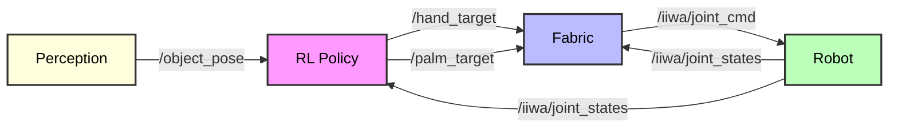
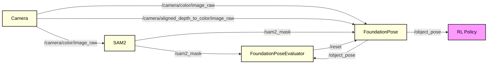
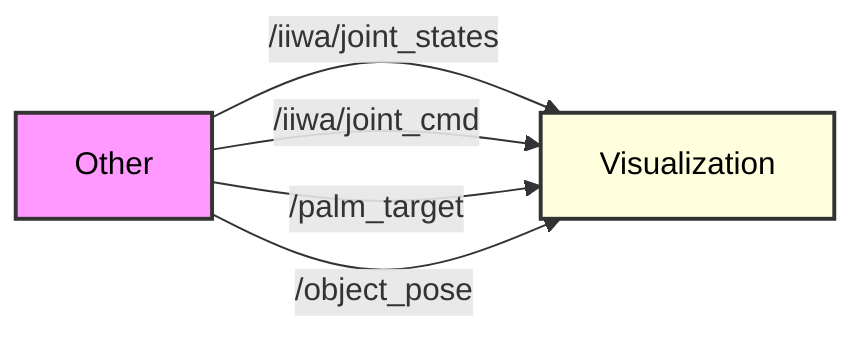

# cross_embodiment_ros

ROS Noetic code for cross embodiment gap project

## Installation

```
# First install mamba (may work with conda too)
mamba create -n cross_embodiment_ros_env python=3.11

# Robostack
conda config --env --add channels conda-forge
conda config --env --add channels robostack-staging
conda config --env --remove channels defaults
mamba install ros-noetic-desktop

# Fabrics
cd ~/github_repos/fabrics-sim
pip install -e .
chmod +x urdfpy_patch.sh
./urdfpy_patch.sh

# Isaacgym_modified  (not isaacgym since it needs python=3.8)
cd /juno/u/tylerlum/isaacgym_modified/isaacgym/python
pip install -e .

# Isaacgymenvs
cd ~/github_repos/bidexhands_isaacgymenvs
pip install -e .

# Other dependencies
pip install pybullet tqdm wandb rl_games ruff
pip install git+https://github.com/tylerlum/fast-simplification.git
```

## Real Nodes:

* `fabric_ros_node.py`: Subscribes to `/iiwa/joint_states` to initialize fabric, subscribes to `/palm_target` and `/hand_target`, publishes to `/fabric_state`
* `fabric_upsampler_ros_node.py`: Subscribes to `/fabric_state`, publishes to `/iiwa/joint_cmd`
* `rl_policy_ros_node.py`: Subscribes to `/iiwa/joint_states`, `/fabric_state`, and `/object_pose`. Publishes to `/palm_target` and `/hand_target`
* `visualization_ros_node.py`: Subscribes to `/iiwa/joint_states`, `/iiwa/joint_cmd`, `/palm_target`, and `/object_pose`. Visualizes all these things for debugging
* `goal_object_pose_ros_node.py`: Publishes to `/goal_object_pose`

## Dummy Nodes for testing:

* `fake_robot_ros_node.py`: Pretends to be real robot. Publishes `/iiwa/joint_states` and subscribes to `/iiwa/joint_cmd`
* `fake_policy_ros_node.py`: Pretends to be RL policy. Publishes `/palm_target` and `/hand_target`
* `fake_object_pose_ros_node.py`: Pretends to be FoundationPose. Publishes `/object_pose`
* `isaac_fake_robot_ros_node.py`: Pretends to be real robot. Publishes `/iiwa/joint_states` and `/object_pose` and subscribes to `/iiwa/joint_cmd`

## Debugging Nodes:

* `fabric_visualizer_ros_node.py`: Subscribes to `/iiwa/joint_states` and `/fabric_state`. Visualizes robot and fabric joint position and velocity in real time, with joint limits.
* `joint_pos_visualizer_ros_node.py`: Subscribes to `/iiwa/joint_states`. Visualizes joint positions and joint limits.
* `joint_vel_visualizer_ros_node.py`: Subscribes to `/iiwa/joint_states`. Visualizes joint velocities.
* `live_plot_joint_data_ros_node.py`: Subscribes to `/iiwa/joint_states` and `/iiwa/joint_cmd`. Plots joint positions and commands in real time.
* `record_joint_data_ros_node.py`: Subscribes to `/iiwa/joint_states` and `/iiwa/joint_cmd`. Records joint positions and commands to a file.
* `sine_wave_publisher_ros_node.py` and `sine_wave_publisher_wider_ros_node.py`: Publishes sine waves to `/iiwa/joint_cmd` for testing.

NOTE: We use a kuka allegro robot, so we also have `/allegroHand_0/joint_states` and `/allegroHand_0/joint_cmd` topics for the hand state and commands, respectively. We keep these out of the descriptions and diagrams for simplicity.

## Useful commands

```
# killros alias
alias killros='ps aux | grep ros | grep tylerlum | awk '\''{print $2}'\'' | xargs kill -9'

# kill command
pkill -9 -f "python rl_"

# ROS_HOSTNAME variable (always correct)
export ROS_HOSTNAME=$(hostname)

# ROS_HOME variable (avoid overloading /afs)
export ROS_HOME=/juno/u/tylerlum
```






